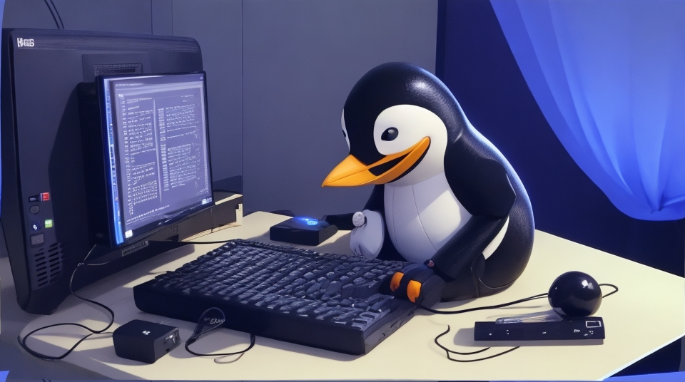

# Repo de Wallpapers
Tal como me lo pidieron, dejo aquí este repo con los wallpapers que uso para los videos y fotos que comparto en mis redes
*De igual manera me comentan cualquier cosa 👨‍💻*

**El que uso actualmente:**

## Índice
- [Gitlab](https://gitlab.com/mundo-devops-repos/miscellaneous/wallpapers)
- [GitHub](https://github.com/Mundo-Dev0ps/wallpapers)

Dentro del directorio **tux-ai** están los directorios
- *large:* formato horizontal
- *short:* formato vertical

### Ejemplos

## Redes:
- *Youtube:* https://www.youtube.com/c/MundoDevOps
- *Tiktok:* https://www.tiktok.com/@mundo.devops
- *Instagram:* https://www.instagram.com/mundo.devops/​
- *Kick:* https://kick.com/mundodevops